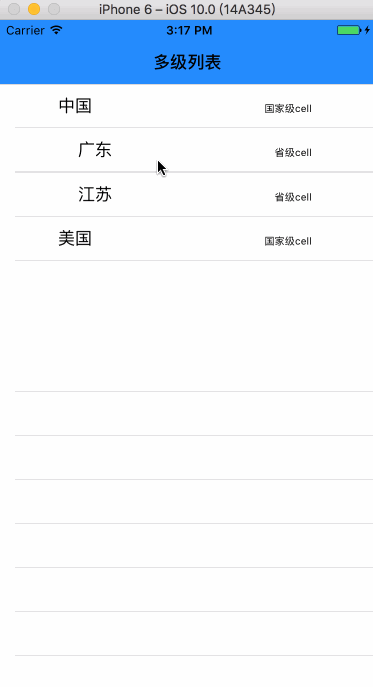
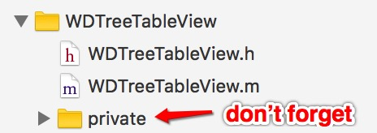

# TreeTableView
多级列表

#Effect diagram



#How To Use
##First
**Drag the folder named "WDTreeTableView" to project**

##Import WDTreeTableView

```ObjC
#import "WDTreeTableView.h"

@property(nonatomic, readwrite, strong)WDTreeTableView *tableView;

WDTreeTableView *treeView = [[WDTreeTableView alloc] initWithFrame:self.view.bounds style:UITableViewStylePlain];
treeView.dataSource = self;    
treeView.delegate = self;
[treeView registerNib:[UINib nibWithNibName:@"CountryCell" bundle:nil] forCellReuseIdentifier:@"Country"];
[treeView registerNib:[UINib nibWithNibName:@"ProvinceCell" bundle:nil] forCellReuseIdentifier:@"Province"];
[treeView registerNib:[UINib nibWithNibName:@"CityCell" bundle:nil] forCellReuseIdentifier:@"City"];
[self.view addSubview:treeView];
```

##Datasource Impletement

```ObjC
- (NSInteger)treeView:(WDTreeTableView *)treeView numberOfChildrenOfItem:(id)item
{
if (!item) {
return self.dataArr.count;
} else
{
TreeObj *obj = (TreeObj *)item;
return obj.childrenCount;
}
return 0;
}

- (id)treeView:(WDTreeTableView *)treeView child:(NSInteger)index ofItem:(id)item {
if (!item) {
return self.dataArr[index];
}
TreeObj *obj = (TreeObj *)item;
return [obj childAtIndex:index];
}

- (UITableViewCell *)treeView:(WDTreeTableView *)treeView cellForItem:(id)item {
NSString *identifier = [NSString stringWithUTF8String:object_getClassName(item)];
WDTreeCell *cell = [treeView dequeueReusableCellWithIdentifier:identifier];
[cell setDataModel:item];

return cell;
}

```

##Delegate Impletement

```ObjC
- (void)treeView:(WDTreeTableView *)treeView didOpenRowForItem:(id)item
{
NSLog(@"已经打开节点");
}

- (void)treeView:(WDTreeTableView *)treeView didCloseRowForItem:(id)item
{
NSLog(@"已经关闭关闭节点");
}

- (void)treeView:(WDTreeTableView *)treeView didSelectRowForItem:(id)item
{
NSLog(@"点击了节点");
}

- (void)treeView:(WDTreeTableView *)treeView didSelectRowOfLastItem:(id)item
{
NSLog(@"点击了叶子节点");
}

- (void)treeView:(WDTreeTableView *)treeView willOpenRowForItem:(id)item
{
NSLog(@"即将打开节点");
}

- (void)treeView:(WDTreeTableView *)treeView willCloseRowForItem:(id)item
{
NSLog(@"即将关闭节点");
}

- (BOOL)treeView:(WDTreeTableView *)treeView shouldOpenRowForItem:(id)item
{
NSLog(@"是否允许打开节点");
return YES;
}

- (BOOL)treeView:(WDTreeTableView *)treeView shouldCloseRowForItem:(id)item
{
NSLog(@"是否允许关闭节点");
return YES;
}

- (CGFloat)treeView:(WDTreeTableView *)treeView heightForRowForItem:(id)item
{
return 50;
}
```

####Warning: The function ```treeView:heightForRowForItem:``` need to be implement!!!!      Default height is 44

##More function
````
You can add the other function by yourself
````


